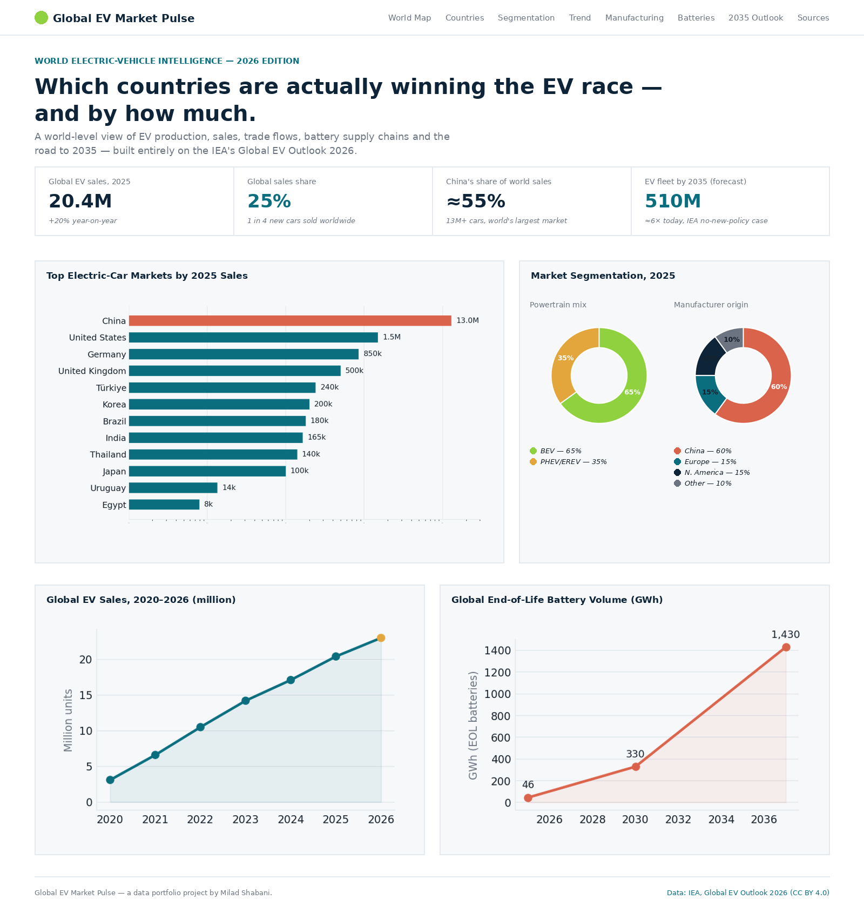

# 🌍⚡ Global EV Market Pulse — 2026 Edition

A world-level electric-vehicle intelligence dashboard: who is producing, selling and
adopting EVs fastest, where the batteries actually come from, and what the IEA's own
scenarios say happens by 2035 — built entirely on real, cited figures from the
**[IEA Global EV Outlook 2026](https://www.iea.org/reports/global-ev-outlook-2026)**.

**[▶ Live dashboard](https://Milad-Shabani.github.io/global-ev-market-pulse/)** ·

[Download the Excel workbook](dashboard/data/EV_Global_Outlook_2026.xlsx)




*Preview render of the dashboard's hero, KPI band, country leaderboard, market-segmentation,
sales-trend and battery-recycling panels — generated from the same underlying data as the live
page (`docs/screenshots/make_preview.py`). The live dashboard also has an interactive world map,
manufacturing, battery-supply-chain, charging, affordability and 2035-outlook sections not
pictured here.*

---

## Why this project

Most "EV dashboards" online recycle the same three headline stats. This project instead
works chapter-by-chapter through the IEA's 2026 outlook — sales, production, trade,
batteries, oil displacement, electricity demand, trucks and two/three-wheelers — and turns
it into:

1. **A single source-of-truth Excel workbook**, generated entirely in Python (`openpyxl`),
   with native charts, tables, conditional formatting and a full citation trail.
2. **An interactive, white-background HTML dashboard** that loads that same data instantly
   (no fetch, no server needed) and renders it with [Chart.js](https://www.chartjs.org/) and
   an interactive [D3](https://d3js.org/) world map — plus a downloadable copy of the
   workbook itself for anyone who wants the raw numbers.

Change a number in the Python script, re-run it, refresh the page — one dataset, two views,
zero drift.

## The headline finding

> China sold more electric cars in 2025 (13M+) than the rest of the world's next dozen
> markets combined, and *produced* roughly three-quarters of every EV built worldwide —
> yet the fastest-*growing* markets in percentage terms were Europe (+30%), Southeast Asia
> (>100%) and Latin America (+75%). The IEA's own scenarios say this is just the beginning:
> global EV sales share is set to roughly double again, from 25% to ~50%, by 2035.

## What's inside

| Sheet / Section | Content |
|---|---|
| **Overview** | Key global indicators, workbook map |
| **Country Leaderboard** | 2025 sales, sales share, YoY growth, fleet-stock share for 26 countries |
| **Historical Trend** | Global EV sales, 2020–2026 (reconstructed + IEA-reported + IEA forecast) |
| **Manufacturing & Trade** | Production concentration, export/import flows |
| **Battery Supply Chain** | Battery-cell production concentration |
| **Market Segmentation** | Powertrain mix, manufacturer origin, regional sales split |
| **Forecast 2035** | IEA exploratory-scenario outlook by market, global fleet projection |
| **Oil & Electricity Impact** | Oil displacement (mb/d) and electricity demand (TWh) |
| **Trucks, Buses & 2/3-Wheelers** | Electrification beyond passenger cars |
| **Charging Infrastructure** | Public/private charging deployment by country, EVs-per-charger, 2035 outlook |
| **Affordability & Running Costs** | BEV-vs-ICE annual running-cost savings by market |
| **Battery Recycling & Second-Life** | End-of-life battery volumes, EU recycled-content rules *(non-IEA sources — see note below)* |
| **Sources** | Full citation trail — every figure traces to a report chapter |

> The **Battery Recycling & Second-Life** sheet/section is the one exception: the IEA report's own
> recycling chapter (Ch. 9, p.223) wasn't fully retrievable from the source used to build this
> project, so that section instead cites S&P Global Mobility, Circular Energy Storage, and the
> EU's Battery Regulation (2023/1542) directly — see its own note and the Sources sheet..


## Task brief (the one I set myself)

**"Build a country-ranked, trade-aware, forward-looking picture of the global EV
transition that a policy analyst or automotive strategist could actually use in a
five-minute skim — sourced only from one primary report, with every non-reported number
clearly flagged as an estimate."**

That constraint (single primary source, full traceability, no invented numbers) is
deliberately harder than pulling from ten scraped blog posts — and closer to what a real
BI/analytics engineer is asked to do with a client's PDF report.

## Tech stack

- **Python** (`openpyxl`, `pandas`) — dataset construction and native-chart Excel generation
- **LibreOffice headless** — formula recalculation during development (verified zero formula errors)
- **HTML / CSS / vanilla JS** — the dashboard shell
- **A plain `window.EV_DATA` JS object** (`dashboard/data/ev_data.js`), generated by the same
  Python script — the dashboard loads this with a normal `<script>` tag instead of fetching the
  `.xlsx` at runtime, so it works offline, opened directly (`file://`), or from any static host
- **[Chart.js](https://www.chartjs.org/)** — the leaderboard, trend, segmentation and forecast charts
- **[D3](https://d3js.org/) + [topojson-client](https://github.com/topojson/topojson-client)** —
  the interactive world map (choropleth), fetching a public [world-atlas](https://github.com/topojson/world-atlas)
  TopoJSON file over the network (the only part of the dashboard that needs internet access)
- **GitHub Actions + GitHub Pages** — automatic deployment on every push to `main`

All third-party scripts are loaded from [jsDelivr](https://www.jsdelivr.com/) pinned to a major
version (e.g. `chart.js@4`), which always resolves to the latest matching release — no exact
patch version to keep in sync by hand.

## Running it locally

```bash
# 1. (Re)generate the workbook + dashboard data from source
cd data
pip install -r ../requirements.txt
python generate_workbook.py
# → writes data/EV_Global_Outlook_2026.xlsx
# → writes dashboard/data/ev_data.js  (what the dashboard actually reads)
# → copies the workbook into dashboard/data/ too, for the "download workbook" link

# optional: force a formula recalculation with LibreOffice headless
# (openpyxl writes formulas without cached values, so viewers that only
# read cached values — pandas, some previewers — see blanks until this runs)
soffice --headless --convert-to xlsx --outdir /tmp EV_Global_Outlook_2026.xlsx
cp /tmp/EV_Global_Outlook_2026.xlsx EV_Global_Outlook_2026.xlsx
cp EV_Global_Outlook_2026.xlsx ../dashboard/data/EV_Global_Outlook_2026.xlsx

# 2. Open the dashboard — no server required
cd ../dashboard
open index.html            # macOS
# xdg-open index.html      # Linux
# or just double-click dashboard/index.html in your file browser

# (a local server also works fine, e.g. `python -m http.server 8000`,
#  but it is no longer required — only the world map needs internet access)
```

> **Regenerating the README preview image:** `docs/screenshots/make_preview.py` renders
> `docs/screenshots/dashboard-preview.png` from the same data (`pip install matplotlib pillow`,
> then `python docs/screenshots/make_preview.py`). For a pixel-perfect capture of the *live*
> page instead, take a real browser screenshot after your first GitHub Pages deploy and
> overwrite that file.


## Publishing to GitHub

A ready-to-run script and a GitHub Actions workflow are included:

```bash
./publish.sh   # macOS/Linux — initialises git, commits, and pushes to your GitHub repo
```

It requires [git](https://git-scm.com/) and the [GitHub CLI](https://cli.github.com/) (`gh`,
logged in via `gh auth login`).

See [`publish.sh`](publish.sh) for the exact steps, and
[`.github/workflows/deploy-pages.yml`](.github/workflows/deploy-pages.yml) for the
auto-deploy-to-GitHub-Pages workflow (enable **Settings → Pages → Source: GitHub Actions**
once, after your first push).

## Data integrity & methodology

- Every figure is either **stated directly** in the IEA Global EV Outlook 2026, or
  **explicitly flagged** as an estimate back-calculated from a stated share × a stated
  regional total (marked `*` in the leaderboard and `estimate` in the workbook).
- The 2020–2024 points in the global sales trend are **reconstructed** from the report's
  stated pattern of ~3.5 million additional annual sales since 2021, anchored to the
  confirmed 2025 figure — this is disclosed on the chart and in the workbook.
- Full citation trail: see the `Sources` sheet in the workbook or the **Sources** section
  of the dashboard.

## Disclaimer

This is an independent portfolio project by [Milad Shabani](https://miladshabani.ir) that
visualises publicly available IEA data (CC BY 4.0). It is **not affiliated with, produced
by, or endorsed by the IEA**. For the authoritative report, see
[iea.org/reports/global-ev-outlook-2026](https://www.iea.org/reports/global-ev-outlook-2026).

## License

Code in this repository is licensed under the [MIT License](LICENSE). The underlying data
is © IEA, used under [CC BY 4.0](https://www.iea.org/terms/creative-commons-cc-licenses) —
please retain the citation if you reuse it. The signature graphic uses the
[Dancing Script](https://fonts.google.com/specimen/Dancing+Script) typeface
(SIL Open Font License 1.1 — see `docs/assets/fonts/LICENSE-OFL.txt`).

---

**Citation:** IEA (2026), *Global EV Outlook 2026*, IEA, Paris,
https://www.iea.org/reports/global-ev-outlook-2026, Licence: CC BY 4.0.
